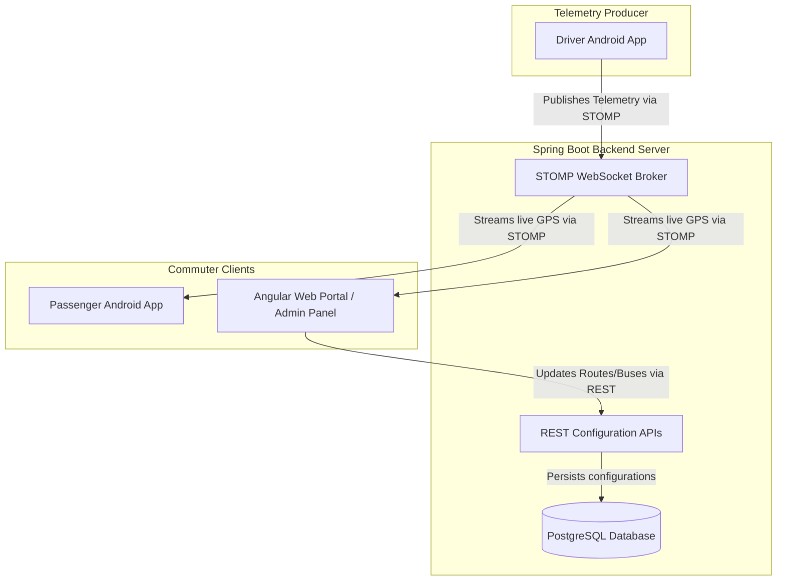

# GEHU LiveBus: College Transit Tracking System

**GEHU LiveBus** is an end-to-end real-time bus GPS tracking and telemetry monitoring system customized for the students, faculty, and shuttle drivers of **Graphic Era Hill University (GEHU)**.

The application serves three active campuses located in **Dehradun**, **Bhimtal**, and **Haldwani**, helping commuters track shuttles, get dynamic arrival estimates, and helping administrators dispatch alerts during delays.

---

## ⚠️ Problem Statement

University shuttle scheduling faces critical operational challenges in regional environments like Dehradun, Bhimtal, and Haldwani:
* **Hilly Terrains & Weather Inclemencies**: Hilly corridors are highly susceptible to heavy rain, seasonal fog, landslides, and road constructions. This causes severe, unpredictable delays that traditional static timetables cannot account for.
* **Blind Commuting**: Students and faculty wait blindly at shuttle checkpoints, having no real-time visibility into whether their assigned bus is ahead of schedule, running late, or already full.
* **Disconnected Operations**: Shuttle drivers lack direct channels to report traffic delays, crowding alerts, or critical emergency distress signals back to central dispatch administrators and commuters.

---

## ✨ Core Features

### 1. Passenger Commuter Portal (Android & Web)
* **Real-time Map Visualizer**: Interactive map (using Leaflet on Web and Google/MapLibre on Android) displaying the live movements of campus buses.
* **Campus Hub Switcher**: Dropdown selector to dynamically swap between **Dehradun**, **Bhimtal**, and **Haldwani** campuses. Selecting a campus instantly updates the corresponding route catalog, stops, and coordinates.
* **Suggested Routes Grid**: Quick-access cards representing different campus routes, showing their destination and active transit status (e.g. `"On Time"`, `"Delayed"`).
* **Itinerary Stop Timeline**: Displays the list of stops along the route corridor (identifying transit checkpoints and final alighting depots).
* **Live Arrival Estimator (ETA)**: Calculates the remaining distance (in km) and estimated minutes until arrival.
* **Mock Ticketing & Alerts**: Allows passengers to purchase/view boarding passes and toggling arrival alert notifications.

### 2. Driver & Operator Portal (Android App)
* **Duty Setup Console**: Allows drivers to choose their assigned campus route and register their specific bus vehicle number (e.g., `UA-07-TA-2024`).
* **Telemetry Broadcast Engine**: Once the shift starts, automatically sends live JSON GPS coordinates payloads to the WebSocket broker every 3 seconds to update the passenger maps.
* **Dispatch Alerts**: Quick-reporting buttons to broadcast delays (e.g., `🟠 Traffic Delay +5m`) or high passenger density (`🔵 Crowd alerts`) to the dispatch center.
* **Emergency Distress (SOS)**: A single-tap SOS button that publishes an emergency broadcast signal to the fleet control console.

### 3. Administrator Console (Angular Web Portal)
* **Route Registry Manager**: Tab to add new campus routes (inputting ID, name, destination, description, card color theme, and durations) or decommission obsolete ones.
* **Fleet Catalog**: List all registered campus shuttle vehicles.
* **Service Advisory Broadcaster**: An alert publisher to broadcast real-time weather alerts or traffic delays to the main passenger home screens.

### 4. Enterprise Backend Services (Spring Boot Server)
* **SockJS & STOMP Message Broker**: Relays coordinate messages from active driver devices to passenger browsers and mobile clients in sub-second latency.
* **PostgreSQL Persistence**: Saves and updates configurations for buses, routes, and coordinates.
* **Spring Security Configurations**: Locks down administrative routes (`/api/admin/**`) and driver shifts (`/api/driver/**`) using role checks and secure password encryption.

---

## 🏛️ System Architecture

The ecosystem consists of three main components:
1. **Spring Boot Backend**: Serves REST configuration endpoints, handles authentication, and acts as the SockJS/STOMP WebSocket message broker for real-time GPS coordinates.
2. **Angular Web Portal**: A web interface featuring Leaflet Maps for live bus routing and a tabbed **Admin Control Panel** to register new routes, manage fleet vehicles, and broadcast advisory alerts.
3. **Android Mobile Application**: A multi-role Compose application:
   * **Passenger Mode**: A dashboard with interactive maps, estimated arrival times (ETA), nearest stops lists, and local alert settings.
   * **Driver Mode**: A shift dashboard for selecting routes and vehicles, broadcasting real-time coordinates, and reporting delays or emergency SOS signals.



---

## 📂 Project Structure

* **`app/`**: Native Android mobile application (Jetpack Compose + Kotlin + Hilt).
  * `ui/home/`: Commuter homepage with campus selectors and suggested routes.
  * `ui/tracking/`: Map layer and WebSocket live tracking engine.
  * `ui/driver/`: Driver shift setup, GPS transmitter, and incident logger.
  * `ui/theme/`: Customized GEHU brand palette (Navy, Gold, Orange).
* **`backend/`**: Spring Boot application (Java 17 + Gradle).
  * `livebus/admin/`: Controllers and database repositories for Route, Stop, and Bus configurations.
  * `livebus/driver/`: Trip controllers mapping active driver shifts.
  * `livebus/security/`: Security configs and user auth controllers.
* **`angular-app/`**: Angular Web application.
  * `app/app.ts`: State managers, Leaflet map renderer, and simulated fallback loops.
  * `app/app.html`: Layout container for sliding panel views, map overlays, and admin tabs.

---

## 🗄️ Database & Schema Specifications

The backend connects to a **PostgreSQL** database running on port **`5433`** (`jdbc:postgresql://localhost:5433/livebus`).

```
  +--------------+        +---------------+        +-------------+
  |    ROUTE     | 1    N |     STOP      | N    1 |     BUS     |
  |  (id, name,  |--------| (id, name,    |--------|  (id, plate,|
  |   dest, dir) |        |  lat, lon)    |        |   capacity) |
  +--------------+        +---------------+        +-------------+
```

Hibernate Automatically generates the following schemas:
* **`Route` Table**: Stores itinerary details.
  * `id` (VARCHAR, Primary Key) - e.g., `"D-1"`
  * `routeName` (VARCHAR) - e.g., `"ROUTE D-1"`
  * `destination` (VARCHAR) - e.g., `"GEHU Clement Town Campus"`
  * `direction` (VARCHAR) - e.g., `"Clement Town Bus Service"`
* **`Stop` Table**: Stores geographical coordinates of boarding checkpoints.
  * `id` (BIGINT, Primary Key)
  * `name` (VARCHAR) - e.g., `"ISBT Terminal"`
  * `latitude` (DOUBLE) - e.g., `30.2872`
  * `longitude` (DOUBLE) - e.g., `77.9984`
* **`Bus` Table**: Identifies shuttle inventory.
  * `id` (VARCHAR, Primary Key) - e.g., `"UA-07-TA-2024"`
  * `capacity` (INT)

---

## 📡 STOMP WebSocket API Reference

### Channels & Endpoints
* **Handshake Endpoint**: `ws://localhost:8080/ws-livebus` (SockJS fallback enabled)
* **Driver Publish Channel**: `/app/driver/update`
* **Passenger Subscription Channel**: `/topic/route/{routeId}` (e.g. `/topic/route/D-1`)

### LocationUpdate Payload (JSON format)
```json
{
  "busId": "UA-07-TA-2024",
  "latitude": 30.2721,
  "longitude": 78.0084,
  "eta": "5 mins",
  "distance": "1.8 km"
}
```

---

## 🔐 Spring Security & Access Control

The backend implements role-based security configurations using **Spring Security** in [SecurityConfig.java](file:///usr/local/google/home/abhayjoshi/AndroidStudioProjects/LiveBus/backend/app/src/main/java/livebus/security/config/SecurityConfig.java):

* **Authorization Rules**:
  * **`ROLE_ADMIN`**: Required to call administration configuration REST endpoints (`/api/admin/**`).
  * **`ROLE_DRIVER`**: Required to execute driver-specific updates (`/api/driver/**`).
  * **Permit All**: Public assets (`.js`, `.css`, `index.html`), authentication endpoint (`/api/auth/login`), passenger data queries (`/api/passenger/**`), and the WebSocket handler (`/ws-livebus/**`) are configured to bypass security.
* **Cryptography**: Password hashing and verification are performed using the **BCrypt** hashing algorithm.

---

## 🚀 Setup & Installation Guide

If you want to clone this repository and run the end-to-end system on your local workstation, follow these steps:

### 📋 Prerequisites
Make sure you have the following installed on your machine:
1. **Java Development Kit (JDK 17 or higher)**
2. **Node.js (v18+) & npm**
3. **PostgreSQL** (running on port `5433` by default)
4. **Android Studio** (Koala or newer, for running the Android mobile application)
5. **Android SDK & Emulator** (configured via SDK Manager in Android Studio)

---

### 1. Database Configuration
1. Open your PostgreSQL client and create a database named `livebus`:
   ```sql
   CREATE DATABASE livebus;
   ```
2. Verify the server is running on port `5433`:
   ```bash
   pg_isready -h localhost -p 5433
   ```
3. *(Optional)* Modify `backend/app/src/main/resources/application.properties` if you need to update the database username/password:
   ```properties
   spring.datasource.username=your_postgres_username
   spring.datasource.password=your_postgres_password
   ```

---

### 2. Spring Boot Backend Server
To build and start the server:
```bash
# From the project root directory
./backend/gradlew -p backend :app:bootRun
```
The server will start up on port `8080`.

---

### 3. Angular Web Portal
You can run the web portal in live-reload development mode, or compile it to be served directly from the Spring Boot backend assets resource folder:

#### Live Development Mode (Port 4200)
```bash
cd angular-app
npm install
npm run start
```
#### Production Build & Sync (Served via Spring Boot on port 8080)
If you want the backend to serve the web interface directly on **`http://localhost:8080/index.html`**:
```bash
cd angular-app
npm install
npm run build:sync
```

---

### 4. Android Mobile Application
1. **Open in Android Studio**: Launch Android Studio and choose **Open an Existing Project**, selecting the root directory of this repository. Let Gradle sync and download dependencies.
2. **Start the Emulator**:
   Launch your preferred Android Virtual Device (AVD) using the Device Manager or command line:
   ```bash
   # List available emulators
   ~/Android/Sdk/emulator/emulator -list-avds

   # Start the emulator (replace Pixel_10_Pro with your emulator name)
   ~/Android/Sdk/emulator/emulator -avd Pixel_10_Pro &
   ```
3. **Compile & Deploy**:
   Build the debug application and install it on the active emulator:
   ```bash
   ./gradlew installDebug && ~/Android/Sdk/platform-tools/adb shell am start -n com.example.livebus/.MainActivity
   ```

---

## 🔧 Troubleshooting Guide

### 1. Driver Location Mismatches
If the map displays "Standby" and passenger devices are not receiving updates, verify:
* The driver application has started location broadcasting (indicated by a green blinking status light in the console).
* The **Stomp Client** URL path matches on both sides:
  * Backend: `WebSocketConfig.java` listens to `/ws-livebus`.
  * Mobile client: `LiveTrackingViewModel.kt` connects to `ws://10.0.2.2:8080/ws-livebus`.

### 2. Android Emulator Loopback
When testing the Android app inside the emulator, **`localhost`** refers to the emulator's internal network. 
* To connect to the Spring Boot backend running on your developer host machine, make sure you configure the WebSocket connection to use the loopback IP **`10.0.2.2`** instead of `localhost`.

---

## ☁️ Cloud & GKE Production Deployment

The ecosystem supports production deployments to **Google Kubernetes Engine (GKE)** with enterprise integrations.

### 1. GKE Production Architecture
* **GKE Gateway API**: Exposes the system to the internet via GKE standard Managed HTTP Application Load Balancers on port `80`.
* **RabbitMQ STOMP Relay**: Runs as a cluster service to act as a centralized broker relay, enabling horizontal scaling of the Spring Boot application pods.
* **PostgreSQL with PostGIS**: High-performance spatial database container (`postgis/postgis`) for GPS coordinate calculations.
* **BestEffort Scheduling**: Resource requests are optimized to run within tight CPU quotas on single-node sandbox clusters.

### 2. Google Secret Manager & CSI Sync
Instead of hardcoding credentials, GKE uses native **Workload Identity** and **GKE Secrets Store CSI Driver** to sync secrets directly from GCP:
1. Credentials (DB, RabbitMQ) are stored in **Google Secret Manager**.
2. A `SecretProviderClass` utilizing the GKE CSI driver `secrets-store-gke.csi.k8s.io` mounts these keys to GKE pods.
3. The GKE Secret Sync controller automatically generates a standard Kubernetes Secret (`livebus-db-secrets`) from these mounts on-the-fly.

### 3. GitLab CI/CD Pipeline
An automated pipeline configuration ([.gitlab-ci.yml](file:///.gitlab-ci.yml)) builds the container images on commit push, pushes them to Google Artifact Registry, and deploys to GKE:
* **Secrets Handling**: Pipeline credentials and GCP Service Account keys are stored securely inside GitLab CI/CD Variables.
* **Manifests**: All GKE deployments reside in the [kubernetes/](file:///kubernetes) directory.

### 4. Switching Client Environments
Instead of modifying view model source code, Android clients dynamically resolve endpoints from **[local.properties](file:///local.properties)**:
* **Local Development**:
  ```properties
  WEBSOCKET_URL=ws://10.0.2.2:8080/ws-livebus
  ```
* **GKE Production**:
  ```properties
  WEBSOCKET_URL=ws://<EXTERNAL-GATEWAY-IP>:80/ws-livebus
  ```
Then compile the application: `./gradlew installDebug`.
