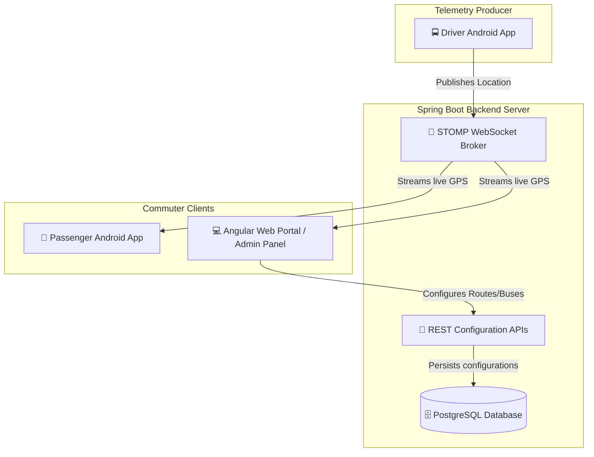

# 🎓 LiveBus: College Transit Tracking System

[](https://developer.android.com)
[](https://angular.dev)
[](https://springboot.io)

**LiveBus** is a premium, real-time bus tracking and telemetry system customized for university students, faculty, and shuttle drivers.

Serving three active campuses in **Dehradun**, **Bhimtal**, and **Haldwani**, it helps commuters track active shuttle buses, receive dynamic arrival estimates, and provides administrators with real-time fleet management capabilities.

---

> [!WARNING]
> ### ⛰️ Operational Challenges in Hilly Terrains
> University shuttle scheduling faces critical environmental hazards in regions like Dehradun, Bhimtal, and Haldwani:
> * **Unpredictable Delays**: Hilly corridors are highly susceptible to heavy rain, seasonal fog, landslides, and road construction. Static timetables are obsolete.
> * **Blind Commuting**: Passengers often wait at checkpoints without any visibility of whether their shuttle is delayed, full, or ahead of schedule.
> * **Disconnected Fleet**: Drivers lack quick mechanisms to report traffic bottlenecks, crowding alerts, or emergency signals to central dispatch.

---

## 🏛️ System Architecture

The ecosystem consists of three unified components:
1. **Spring Boot Backend**: Serves REST configuration APIs, manages user sessions, and acts as the SockJS/STOMP WebSocket message broker for GPS streams.
2. **Angular Web Portal**: Leaflet Maps-based tracking for commuters alongside a secure **Admin Management Panel** to register new routes, audit fleet vehicles, and broadcast bulletins.
3. **Android App (Jetpack Compose)**: Supports dual-roles:
   * **Commuter Mode**: Interactive maps, live arrival estimates (ETA), nearest stops lists, and local alert settings.
   * **Driver Mode**: Shift dashboard to select active routes and buses, broadcast location updates, and log traffic bottlenecks or distress SOS signals.



---

## 📂 Project Structure

```
├── app/                  # Android Mobile Application (Jetpack Compose + Kotlin + Hilt)
│   ├── ui/auth/          # Unified portal login screen and credentials handlers
│   ├── ui/home/          # Passenger homepage, route suggestions, and campus selectors
│   ├── ui/tracking/      # Map layer and WebSocket live tracking engine
│   └── ui/driver/        # Shift management, telemetry broadcaster, and incident reporter
├── backend/              # Spring Boot Backend Service (Java 17 + Gradle)
│   ├── livebus/admin/    # Controllers, services, and repositories for Route, Stop, and Bus
│   ├── livebus/driver/   # Telemetry and active driver shift mapping APIs
│   └── livebus/security/ # Spring Security, User details service, and auth controllers
└── angular-app/          # Angular Web Application (Angular 17 + Leaflet + Tailwind CSS)
    ├── app/app.ts        # State management, Leaflet renderer, and mock coordinate loops
    └── app/app.html      # UI layouts, sliding panel transitions, and Admin console tabs
```

---

## 🔐 Default Access Credentials

The database seeder automatically initializes the system with testing accounts:

| Role | Username | Password | Access Details |
| :--- | :--- | :--- | :--- |
| **Administrator** | `admin` | `admin123` | Unlocks Angular Admin Tabs / Management REST endpoints |
| **Bus Driver** | `driver` | `driver123` | Access to GPS telemetry broadcast and incident console |
| **Commuter / Student** | *Any ID* (e.g. `10001`) | *Same as ID* (e.g. `10001`) | Dynamic local registration as `ROLE_PASSENGER` |

---

## 🗄️ Database Schema Specification

The backend connects to **PostgreSQL** (running on port `5433` by default):

```
  +--------------+        +---------------+        +-------------+
  |    ROUTE     | 1    N |     STOP      | N    1 |     BUS     |
  |  (id, name,  |--------| (id, name,    |--------|  (id, plate,|
  |   dest, dir) |        |  lat, lon)    |        |   capacity) |
  +--------------+        +---------------+        +-------------+
```

### Schemas
* **`Route`**: Stores campus itinerary details (`id`, `route_name`, `destination`, `direction`).
* **`Stop`**: Stores geographical checkpoints (`id`, `name`, `latitude`, `longitude`).
* **`Bus`**: Identifies shuttle inventory (`id`, `capacity`).
* **`User`**: Secure accounts (`id`, `username`, `password_hash`, `role`).

---

## 📡 WebSocket API Reference

### Channels & Endpoints
* **Connection Handshake**: `ws://localhost:8080/ws-livebus` (SockJS fallback enabled)
* **Driver Telemetry Broadcast**: `/app/driver/update`
* **Passenger Telemetry Subscription**: `/topic/route/{routeId}` (e.g. `/topic/route/D-1`)

### Payload Example (JSON)
```json
{
  "busId": "UA-07-TA-2024",
  "latitude": 30.2721,
  "longitude": 78.0084,
  "eta": "5 mins",
  "distance": "1.8 km"
}
```

---

## 🚀 Setup & Installation Guide

### 📋 Prerequisites
* **Java Development Kit (JDK 17 or higher)**
* **Node.js (v18+) & npm**
* **PostgreSQL** (running on port `5433`)
* **Android Studio** (Koala or newer) with Android SDK and Emulator

### 1. Database Initialization
1. Create your database:
   ```sql
   CREATE DATABASE livebus;
   ```
2. Verify connectivity:
   ```bash
   pg_isready -h localhost -p 5433
   ```

### 2. Spring Boot Backend Server
Compile and start the server on port `8080`:
```bash
./backend/gradlew -p backend :app:bootRun
```

### 3. Angular Web Portal
You can run the web portal in live-reload development mode, or compile it to be served directly from the Spring Boot backend static directory:

#### Production Build & Sync (Served via port 8080)
```bash
cd angular-app
npm install
npm run build:sync
```
Open **`http://localhost:8080`** in your browser.

### 4. Android Mobile Application
1. Open the project root folder in **Android Studio**.
2. Start your active virtual device emulator.
3. Build and install the APK on the emulator:
   ```bash
   ./gradlew installDebug && adb shell am start -n com.example.livebus/.MainActivity
   ```

---

> [!NOTE]
> ### 💡 Troubleshooting & Sandbox Configuration
> * **Cleartext HTTP**: Cleartext connections to custom host IPs are permitted via the updated `AndroidManifest.xml` config policy.
> * **Emulator Loopback**: When debugging on the Android emulator, use **`10.0.2.2`** instead of `localhost` in your properties to reach the server on your development machine.

---

## ☁️ Cloud & GKE Production Deployment

The ecosystem supports production deployments to **Google Kubernetes Engine (GKE)** with enterprise integrations.

### 1. GKE Production Architecture
* **GKE Gateway API**: Exposes the system to the internet via GKE standard Managed HTTP Application Load Balancers on port `80`.
* **RabbitMQ STOMP Relay**: Runs as a cluster service to act as a centralized broker relay, enabling horizontal scaling of the Spring Boot application pods.
* **PostgreSQL with PostGIS**: High-performance spatial database container (`postgis/postgis`) for GPS coordinate calculations.
* **BestEffort Scheduling**: Resource requests are optimized to run within tight CPU quotas on single-node sandbox clusters.

### 2. Google Secret Manager & CSI Sync
Instead of hardcoding credentials, GKE uses native **Workload Identity** and **GKE Secrets Store CSI Driver** to sync secrets directly from GCP:
1. Credentials (DB, RabbitMQ) are stored in **Google Secret Manager**.
2. A `SecretProviderClass` utilizing the GKE CSI driver `secrets-store-gke.csi.k8s.io` mounts these keys to GKE pods.
3. The GKE Secret Sync controller automatically generates a standard Kubernetes Secret (`livebus-db-secrets`) from these mounts on-the-fly.

### 3. GitLab CI/CD Pipeline
An automated pipeline configuration ([.gitlab-ci.yml](file:///.gitlab-ci.yml)) builds the container images on commit push, pushes them to Google Artifact Registry, and deploys to GKE:
* **Secrets Handling**: Pipeline credentials and GCP Service Account keys are stored securely inside GitLab CI/CD Variables.
* **Manifests**: All GKE deployments reside in the [kubernetes/](file:///kubernetes) directory.

### 4. Switching Client Environments
Instead of modifying view model source code, Android clients dynamically resolve endpoints from **[local.properties](file:///local.properties)**:
* **Local Development**:
  ```properties
  WEBSOCKET_URL=ws://10.0.2.2:8080/ws-livebus
  ```
* **GKE Production**:
  ```properties
  WEBSOCKET_URL=ws://<EXTERNAL-GATEWAY-IP>:80/ws-livebus
  ```
Then compile the application: `./gradlew installDebug`.
